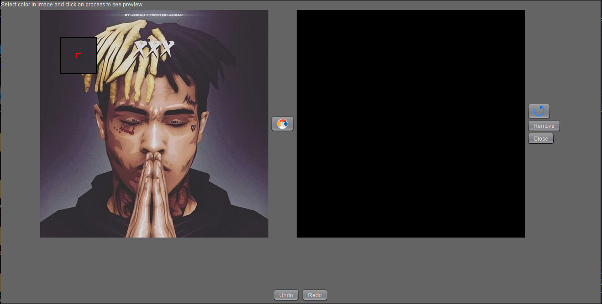

# Lemon

## Note: Screenshots may not be up to date.

Image editing software with some Smart Tools.

## What can this software do:
1. Vanishing Point Filter (Currently under construction. Does not work right now).
2. Color Range Tool
3. Many basic filters
4. Not much artistic filter
5. Crop, resize images
6. Blend images

## Upcoming features
1. Layer System
2. Decent working Vanishing Point Filter
3. Custom Color Picker

Mini version of photoshop :D

-> A work in progress by RigelStar.

# Libs used
1. RampCV
2. PikselPainter
both are mine easy to use libraries

# Screenshots

# Home View

# Vanishing Point Filter

# Color Range Tool

